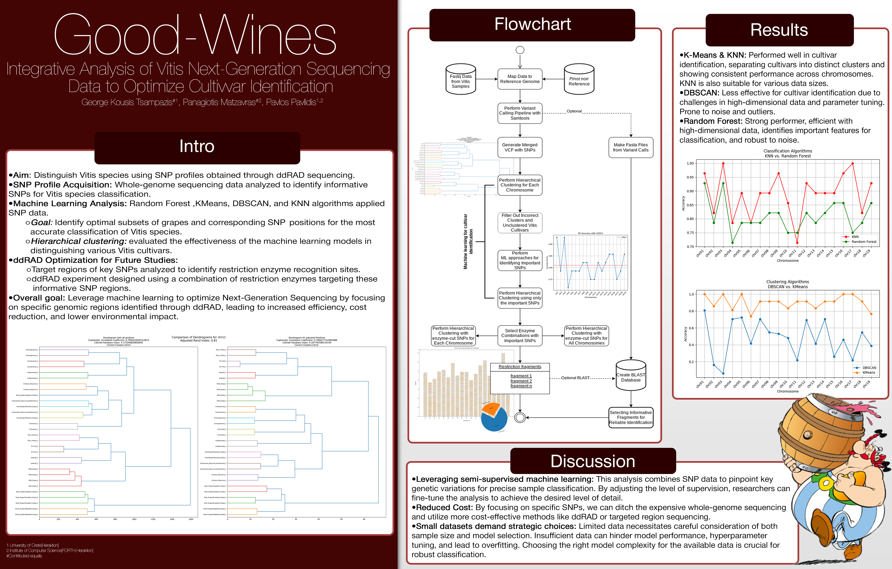
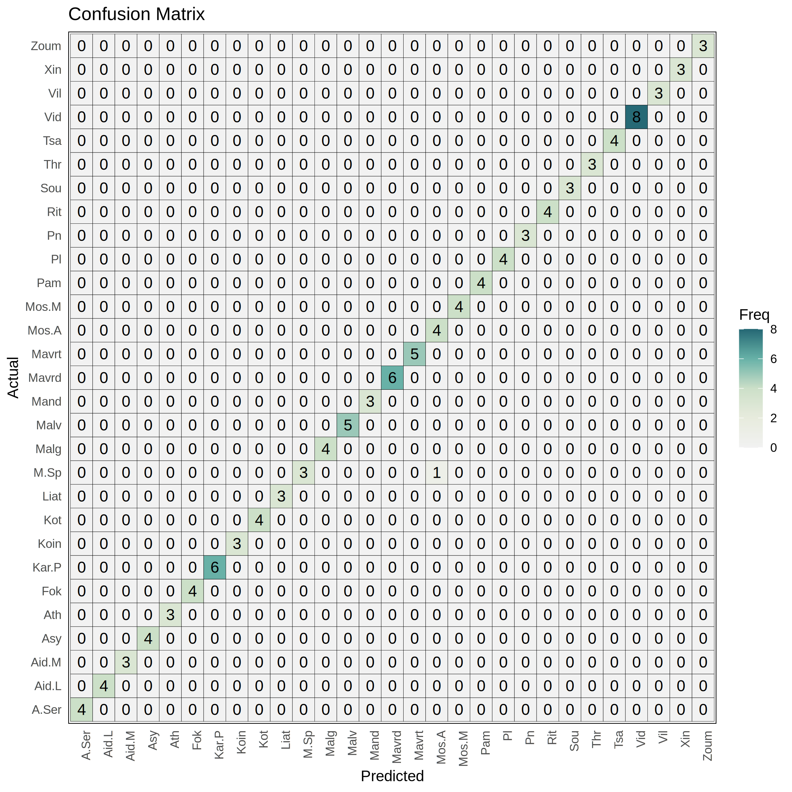
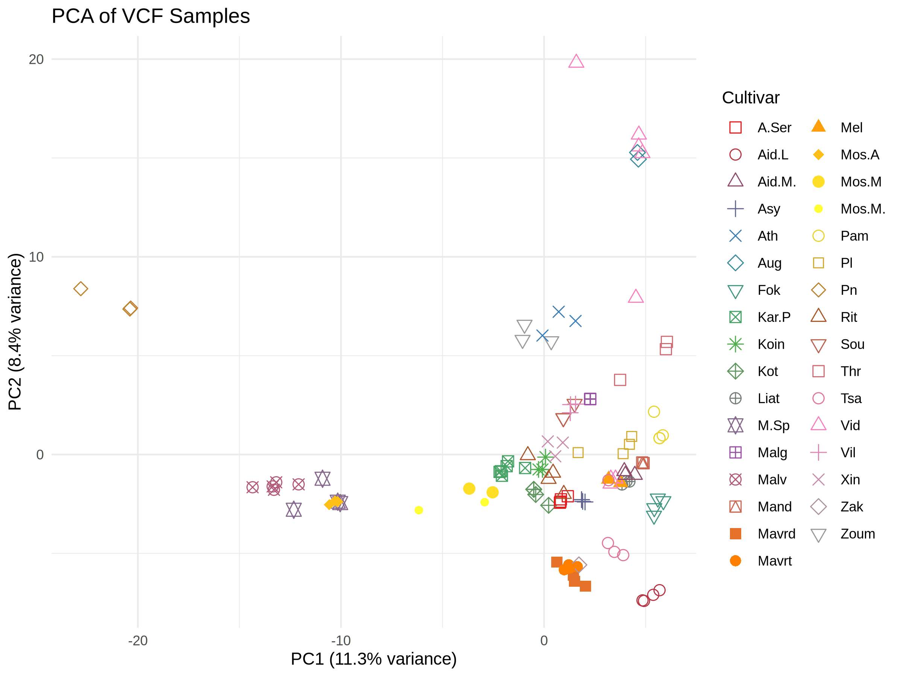

# Good-Wines Pipeline

# Project Background

The Good Wines project involves the comprehensive analysis of numerous Vitis vinifera samples sourced from various regions. This endeavor aims to identify crucial SNPs that play a pivotal role in accurate identification. Subsequently, these identified SNPs will be employed in a targeted ddRAD analysis.

So, first we downloaded public data to find informative SNPs that help us separate cultivars. Then, in silico ddRAD was performed using [ddraptor](https://github.com/geokousis/ddraptor), and from there, informative SNPs that help separate cultivars and are included in fragments were selected. After that, we received ddRAD samples and performed ddRAD analysis.

# Pipeline Overview

This repository contains a bioinformatics pipeline for exploring and identifying PCR-friendly regions for feature-targeted, cheap cultivar identification using ddRAD sequencing data. The workflow is a work in progress and the README will be updated as the project evolves.

## Main Pipeline Scripts

The following scripts are used in the main workflow:

1. `scripts_all/demultiplexing.sh` – Demultiplexes raw sequencing data using ipyrad.
2. `scripts_all/fastp.sh` – Performs quality control and trimming with fastp.
3. `scripts_all/bwa-meme.sh` – Maps reads to the reference genome using BWA-MEME.
4. `scripts_all/Dragencaller.sh` – Calls variants and generates VCF files.
5. `scripts_all/filter_gvcf_phase1.py` – Analyzes missingness in VCF files.
6. `scripts_all/filter_gvcf_phase2.sh` – Filters VCF by sample and missingness.
7. `scripts_all/filter_gvcf_phase3.sh` – Filters regions and SNPs using BED and VCF files.
8. `scripts_all/filter_gvcf_phase4.sh` – Final filtering of SNP and GVCF files.
9. `scripts_all/hot_5.py` – Identifies PCR-friendly hotspots.
10. `scripts_all/ml.py` – Machine learning pipeline for hotspot selection.
11. `scripts_all/Results_2.R` – Visualization and post-processing in R.
12. `scripts_all/Results_2_up.R` – Additional R-based visualization and analysis.

## Results

Example results and figures are available in the `images/` directory. See below for the available figures:

## Status

**This pipeline and documentation are a work in progress.**
- The README will be updated with more detailed instructions and usage examples.
- Some scripts and parameters may change as the project develops.

## Getting Started

1. Clone the repository.
2. Review and edit the scripts in `scripts_all/` as needed for your data and environment.
3. Run the scripts in the order listed above.

For questions or contributions, please open an issue or pull request.
